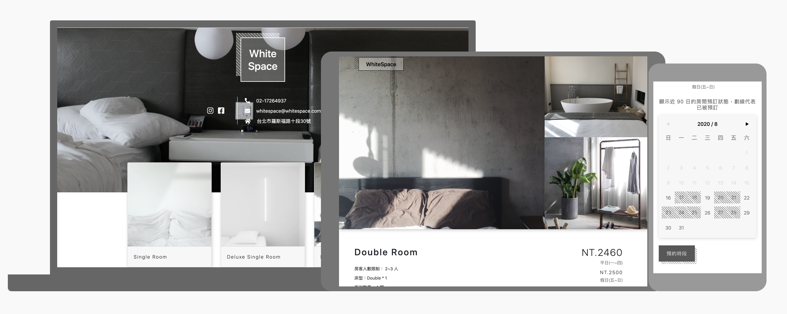

# 旅館預約服務
[Demo](https://yachen168.github.io/Hotel-Reservation/)

## 使用技術
- Vue CLI
- Vuex
- Vue Router
- BootstrapVue
- Font Awesome
- NProgress
- Sass
- Vue.js Datepicker
- Axios

## 實現功能
共 2 個頁面，使用 BootstrapVue 的網格系統，皆有 RWD，支援手機、平板、電腦等裝置。
實現功能與使用者情境如下：

### 首頁
- 能看到所有房型(6 種)，且點擊任一房型，可進入該房型詳細資訊頁面。
- 輪播圖 - 共 6 種房型照。

### 單一房型頁面：
- 顯示該房型詳細資訊，例如旅館描述、平日價格、假日價格、check in 與 check out 時間、其他服務等。
- 點擊上方房型圖片，可放大檢視該圖片，同時包含其他圖片輪播(純手刻)。
- 可以在日曆上瀏覽未來 90 天已被預約 / 尚未預約狀態。
- 可以進行線上訂房，需填寫符合格式的姓名、電話、預約起迄，使用正則表達式進行表單驗證。
- 在選擇預約日期時，會即時顯示訂房價格總價 (平日價 + 假日價)。
- 只能預約未來 90 天內的時段。
- 在頁面跳轉與等待預約結果時，添加 loading，提高使用者體驗。
- 回傳預約結果：
  - 成功：即時顯示(highlight)在日曆上
  - 失敗：預約時間已被人預訂

 

[API 文件](https://challenge.thef2e.com/news/17)  
[設計稿](https://z7x2c0v0b8.github.io/the_f2e_2nd/hotel_reservation.html#artboard0)
